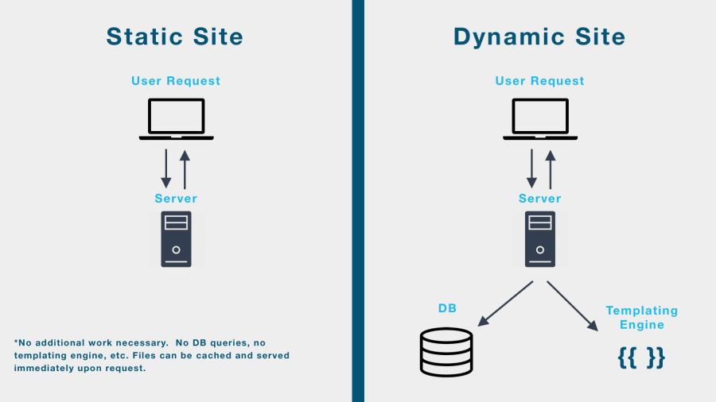

# Express.js-Documentaion

## <a href="https://expressjs.com/">Express.JS </a> kya hai

**Express.js** ek web framework hai jo Node.js ka use krke bnaya gya hai. 

Yeh hume web applications banane mein madad karta hai.

## Framework kya hai

**Framework** ek pehle se tyar kia hua structure hai, jo **reusable components**, **tools**, aur **guidelines** ka set pradan krata hai.  
Iska kaam development process ko tez, aasaan aur oraganized bnana hota hai.

 **Chaliye ek ghar banane ka example lekar framework ka concept samajhte hain:**

### Without a Framework (Scratch se shuru karna):  
Sochiye aapko ek ghar banana hai aur aapke paas **koi prebuilt structure nahi hai**:  

1. **Foundation khud se banani padegi**: Zameen khod kar ek strong base banana hoga.  
2. **Raw materials collect karne padenge**: Cement, bricks, wood, aur pipes sab alag-alag khud arrange karna hoga.  
3. **Har cheez ka design aur execution**: Walls kaise khadi hongi, roof kaise banegi, plumbing aur wiring kaise karein — sab kuch manually plan karna padega.  
  
**Result**: Zyada time lagega aur har cheez ko scratch se banane ke chakkar mein kaam mushkil aur inefficient hoga.  

---

### With a Framework (Prebuilt Structure Ka Use):  
Ab sochiye aapke paas ek **house-building framework** hai, jisme kuch cheezein pehle se ready hain:  

1. **Prebuilt Foundation**: Zameen pe foundation pehle se banayi hui hai. Aapko directly walls banana shuru karna hai.  
2. **Reusable Components**: Walls, windows, aur doors pehle se bne bnay hain.
3. **Guidelines (Blueprint)**: Architect ne ek blueprint diya hai jo batata hai ki kaun sa component kahaan fit hoga.
4. **Tools Available**: Construction ke tools, jaise drills aur cranes, aapke paas hain jo kaam asaan aur fast kar dete hain.  

**Result**: Framework ke use se aap ghar ko jaldi aur efficiently bana paate hain, kyunki aapko basic structure ya raw materials banane ki tension nahi hai.  

---

## Web Framework kya hai

Ek framework jo web application bnane jese kaam ko simplify kr  deta hai and web application bnana asan bna deta hai.

## **Web Application Kya Hai** 

Ek aisi software application server pe run krti hai lekin hum usey access and use krte hai through a browser.    4

Iska matlab hai ki aapko is application ko use karne ke liye apne computer pe koi special software install karne ki zarurat nahi hoti, bas internet aur web browser (jaise Chrome, Firefox) hona chahiye.

**Example :** <a href="https://workspace.google.com/intl/en_in/products/docs/" > Google Docs</a>, <a href="https://docs.google.com/spreadsheets/d/1atQuQMyNWS8ooo8qoo-fcw8ZJhjK1qDXumblJdurJvY/edit?gid=0#gid=0">Google Sheet </a> etc.

Web applications static websites se different hoti hain kyunki ye interactive and dynamic hoti hain aur ye database aur server ke sath connect hoti hain.  
Web application user ko content create,read ,edit and delete krna ki functionality provide karati hai jabki static and dynamic webisite user of sirf read krne ki functionality provide karati hai.  

**Static Website :**
Static website wo hoti hai jisme server webpages ko vse hi server krta hai jse vo server pr store hote hai, isse website ka content hmesha fix rhta hai.  
Example--> <a href="https://wonderfullandingpage.github.io/mylandingpage/"> Landing Page </a>,<a href="https://nodejs.org/docs/latest/api/">Documentation website </a> etc.

**Dynamic Website :** Ye wo webiste hoti jisme server  webpage ko khudse created krta hai har for every request that comes to the server using UI templates  and fr vo us naye created webpage ko client computer ko send krta hai, isse website ka content kabhi fix nhi hota.  
Example --> <a href="https://indianexpress.com/"> News Website </a>, <a href="https://www.netflix.com/in/">Entertainment Website </a> etc.

**Database :**
Database ek jagah hai jahan data ya information store ki jaati hai, jaise naam, email, ya order details. Yeh data ko sambhalne aur jaldi se dhoondhne mein madad karta hai.
.

**Server :**
Server ek powerful computer hota hai jo internet pr dusre computer ki request ko sunta hai and fir unke javab me koi data us computer ko vapas deta hai like webpages.

##  <a href="https://nodejs.org/en">Node.Js</a> Kya hai

Nodejs ek Runtime environment hai jo JavaScript me likhe program ko server-side pe execute karne ke liye use hota hai,taki hum javascript ka use krke computer ko instructions de ske.

**Runtime -** Runtime woh time period hota hai jab aapka program actually execute(run) ho raha hota hai.

**Enviroment -** Environment ka matlab hai aas-paas ka mahaul ya wo conditions jinme koi cheez exist karti hai ya koi kaam hota hai

**Program -** Program ek set of instructions hota hai jo computer ko batata hai ki usse kya karna hai.

**Runtime Environment -** Ye wo jagah hai jahan hum apna program chala sakte hain, taaki hum computer ko kuch kaam karne ke liye instructions de sakein.

