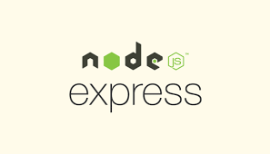

# Express.js-Documentaion

## <a href="https://expressjs.com/">Express.JS </a> kya hai

**Express.js** ek web framework hai jo Node.js ka use krke bnaya gya hai. 

Yeh hume web applications banane mein madad karta hai.

## Framework kya hai

Framework ek aisa soch smjhkar bnaya hua physical structure ya fr socha-samjha bnaya hua plan hota hai jo hume kisi kaam ko karne mein support deta hai aur us kaam ko asaan aur sahi tareeke se karne mein madad karta hai.

**Example :** 
Socho tumne decide kiya hai ki tumhe apni health improve karni hai aur apne body goals achieve karne hain. Agar tum bina kisi plan ke randomly exercise karoge, toh shayad tumhe expected results nahi milenge, aur kabhi kabhi confusion bhi ho sakta hai ki kaun si exercise kab aur kitni baar karni hai.

Yahan pe ek fitness plan framework ki tarah kaam karta hai. Isme tum apne goals aur body needs ke hisaab se ek detailed plan banate ho. Jaise:

**Monday** - Cardio (Running, Cycling)  
**Tuesday** - Strength Training (Upper Body - Push-ups, Dumbbells)  
**Wednesday** - Rest Day (Body recovery ke liye)  
**Thursday** - Cardio + Core (Running, Abs exercises)  
**Friday** - Strength Training (Lower Body - Squats, Lunges)  
**Saturday** - Flexibility and Mobility (Yoga, Stretching)  
**Sunday** - Rest Day

## Web Framework kya hai

Ek framework jo web application bnane jese kaam me shara deta hai and web application bnana asan bna deta.

### **Web Application Kya Hai** 

**web application** ek aisi software application hai jo web browser ke through use ki ja sakti hai. Iska matlab hai ki aapko is application ko use karne ke liye apne computer pe koi special software install karne ki zarurat nahi hoti, bas internet aur web browser (jaise Chrome, Firefox) hona chahiye.

Web applications static websites se different hoti hain kyunki ye interactive aur dynamic hoti hain, ye database aur server ke sath connect hoti hain. Jab user kisi web application pe koi action perform karta hai, jaise ki button click karna ya form submit karna, toh wo server pe request send karta hai aur uske response me application data show karti hai.

**Database :**
Database ek jagah hai jahan data ya information store ki jaati hai, jaise naam, email, ya order details. Yeh data ko sambhalne aur jaldi se dhoondhne mein madad karta hai.

**Static Website :**
Static website wo hoti hai jisme content (matlab text aur images) fix hota hai aur sab users ko same dikhta hai. Isme kuch change ya update nahi hota jab tak manually edit na kiya jaye.

**Server :**
Server ek powerful computer hota hai jo internet pe koi client ki request ko sunta hai and fir unke javab me koi data client ko vapas deta hai like webpages.
##  <a href="https://nodejs.org/en">Node.Js</a>

Nodejs ek Runtime environment hai jo JavaScript me likhe program ko server-side pe execute karne ke liye use hota hai,taki hum javascript ka use krke computer ko instructions de ske.

**Runtime -** Runtime woh time period hota hai jab aapka program actually execute(run) ho raha hota hai.

**Program -** Program ek set of instructions hota hai jo computer ko batata hai ki usse kya karna hai.

**Enviroment -** Environment ka matlab hai aas-paas ka mahaul ya wo conditions jinme koi cheez exist karti hai ya koi kaam hota hai

**Runtime Environment -** Ye wo jagah hai jahan hum apna program chala sakte hain, taaki hum computer ko kuch kaam karne ke liye instructions de sakein.

